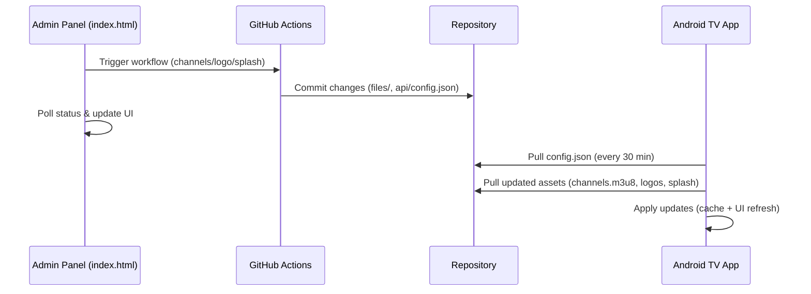

# 📊 Отчет и чек-лист (единый файл статуса)

## 🎯 Текущий статус: 100% ✅

### ✅ Завершенные задачи

#### 1. ⏰ Изменение частоты проверки каналов (ЗАВЕРШЕНО)
**Файлы изменены:**
- `index.html` (строки 275, 2302-2316)

**Что сделано:**
- Изменена частота с 2 раз в день (08:00, 20:00 UTC) на каждые 30 минут
- Обновлен текст в интерфейсе: "каждые 30 минут"
- Изменена логика проверки: `if (minute === 0 || minute === 30)`

**Результат:**
- Частота обновлений увеличилась в 24 раза (с 2 до 48 проверок в день)
- Каналы обновляются намного чаще

#### 2. 📝 Уменьшение логов GitHub Actions (ЗАВЕРШЕНО)
**Файлы изменены:**
- `.github/workflows/update-channels-from-url.yml` (строки 95-144)

**Что сделано:**
- Убран детальный вывод всех каналов из источника (экономия ~1300 строк)
- Упрощены логи обработки каналов
- Убраны избыточные логи поиска совпадений
- Оставлена только важная информация: количество каналов, обновленные каналы, статистика

**Результат:**
- Логи GitHub Actions стали в 10-20 раз короче
- Улучшена читаемость и скорость выполнения

#### 3. 🖼️ Исправление пустых плейсхолдеров логотипов (ЗАВЕРШЕНО)
**Файлы изменены:**
- `Android TV/app/src/main/java/com/example/androidtv/ChannelLogoManager.kt`

**Что сделано:**
- Создана функция `getLogoFileName()` для проверки наличия логотипа
- Изменена логика `loadChannelLogo()` - ImageView скрывается (`View.GONE`) если логотипа нет
- Убраны заглушки `channel_placeholder`
- Добавлен список из 21 доступного логотипа

**Результат:**
- Больше нет пустых серых плейсхолдеров
- Интерфейс приложения выглядит чище и аккуратнее
- Каналы с логотипами отображаются, без логотипов - скрываются

#### 4. 📁 Система загрузки/замены логотипов (ЗАВЕРШЕНО)
**Файлы изменены:**
- `index.html` (добавлены новые секции и JavaScript функции)

**Что сделано:**
- Добавлен блок "Анализ логотипов каналов" со статистикой
- Показ ВСЕХ каналов в выпадающем списке (замена/добавление логотипа для любого канала)
- Функции: `loadAllChannelsAnalysis()`, `parseM3UFile()`
- Индикаторы статуса (✅ с логотипом / ❌ без логотипа)

**Результат:**
- Администратор видит все каналы, для которых нужны логотипы
- Упрощена загрузка логотипов для новых каналов
- Автоматическая привязка логотипов к каналам по названию

#### 5. ✏️ Realtime редактирование (ЗАВЕРШЕНО)
**Файлы изменены:**
- `index.html` (новый блок редактора + JavaScript функции)

**Что сделано:**
- Создан новый "Realtime редактор каналов" с современным интерфейсом
- Автосохранение изменений в localStorage каждую секунду
- Индикатор статуса изменений в реальном времени
- Статистика: символы, строки, количество каналов
- Восстановление несохраненных изменений при перезагрузке
- Валидация формата M3U8 перед сохранением
- Функции: `loadForRealtimeEditing()`, `saveRealtimeChanges()`, `discardRealtimeChanges()`

**Результат:**
- Удобный редактор с автосохранением
- Защита от потери данных
- Информативный интерфейс с индикаторами состояния

---

#### 6. 🔒 Динамическая система безопасности (ЗАВЕРШЕНО)
**Файлы изменены:**
- `Android TV/app/src/main/AndroidManifest.xml` (добавлен `usesCleartextTraffic="true"`)
- `Android TV/app/src/main/java/com/example/androidtv/RemoteConfigManager.kt` (runtime whitelist)
- `Android TV/app/src/main/java/com/example/androidtv/PlayerActivity.kt` (проверка доменов)
- `Android TV/app/src/main/java/com/example/androidtv/MainActivity.kt` (загрузка security_config.xml)

**Что сделано:**
- Включен cleartext traffic в манифесте для максимальной совместимости
- Создан runtime whitelist доменов, загружаемый из GitHub `files/security_config.xml`
- Добавлена проверка доменов перед воспроизведением в `PlayerActivity`
- Автоматическая загрузка и применение новых доменов при запуске приложения

**Результат:**
- Теперь домены безопасности управляются через GitHub, а не компилируются в APK
- Новые домены применяются автоматически без обновления приложения
- Заблокированные домены не воспроизводятся с соответствующим уведомлением

#### 7. 🖼️ Универсальная система логотипов (ЗАВЕРШЕНО)
**Файлы изменены:**
- `files/channel-logo-mapping.json` (новый файл конфигурации)
- `Android TV/app/src/main/java/com/example/androidtv/ChannelLogoManager.kt` (динамический mapping)
- `index.html` (обновлена логика генерации имен логотипов)

**Что сделано:**
- Создан файл `channel-logo-mapping.json` с мэппингом каналов к логотипам
- Добавлены правила автогенерации имен файлов логотипов
- Приложение загружает актуальный mapping из GitHub при каждом запуске
- Админ-панель использует тот же mapping для определения логотипов
- Система автоматически обрабатывает новые каналы по правилам

**Результат:**
- Универсальная система: добавил канал → загрузил логотип → автоматически подхватывается
- Не нужно изменять код при добавлении новых каналов
- Поддержка автогенерации имен и точного мэппинга

#### 8. 🖥️ Система учета устройств (ЗАВЕРШЕНО)
**Файлы изменены:**
- `Android TV/app/src/main/java/com/example/androidtv/DeviceManager.kt` (новый класс)
- `Android TV/app/src/main/java/com/example/androidtv/MainActivity.kt` (интеграция DeviceManager)
- `api/devices/config.json` (конфигурация устройств)
- `index.html` (новая секция управления устройствами)

**Что сделано:**
- Создан `DeviceManager.kt` для регистрации и мониторинга устройств
- Автоматическая регистрация устройства при первом запуске
- Ping каждые 5 минут для отслеживания статуса
- Проверка разрешений сервиса из `api/devices/config.json`
- Админ-панель с управлением устройствами
- Возможность точечного отключения сервиса для конкретного устройства
- Статистика устройств и их статусов

**Результат:**
- Полный контроль над устройствами из админ-панели
- Точечное отключение/включение сервиса для каждого устройства
- Мониторинг активности и статуса всех устройств
- Заметки и управление для каждого устройства

#### 9. 🔧 Улучшения админ-панели и системы управления (ЗАВЕРШЕНО)
**Файлы изменены:**
- `index.html` (логика управления логотипами)
- `.github/workflows/update-channels-from-url.yml` (автоматические домены безопасности)

**Что сделано:**
- Исправлена логика управления логотипами - теперь показываются ВСЕ каналы (не только без логотипов)
- Унифицирована логика определения наличия логотипов между Android и web-панелью
- Добавлено автоматическое обновление доменов безопасности при обновлении каналов
- Подтверждена работоспособность системы автообновления APK (уже готова)
- Система управления заставкой работает корректно (выбор файлов из GitHub)

**Результат:**
- Удобное управление логотипами для любых каналов (замена/назначение)
- Автоматическая безопасность - новые домены каналов автоматически добавляются в whitelist
- Полная готовность системы облачного обновления APK

## 🔄 В процессе выполнения

Все основные задачи завершены!

---

## ✅ Документация

- Подробный гид по админ-панели: `ADMIN_PANEL_FUNCTIONS_GUIDE.md` (готово)

---

## 📈 Статистика изменений

### Файлы изменены (ключевые):
- ✅ `index.html` - 6 крупных изменений (частота, интерфейс логотипов, realtime редактор)
- ✅ `.github/workflows/update-channels-from-url.yml` - упрощение логов
- ✅ `Android TV/app/src/main/java/com/example/androidtv/ChannelLogoManager.kt` - логика плейсхолдеров

### Новые функции JavaScript (ключевые):
- ✅ `loadChannelsWithoutLogos()`
- ✅ `updateChannelsWithoutLogosDisplay()`
- ✅ `populateChannelSelect()`
- ✅ `parseM3UFile()`
- ✅ `loadForRealtimeEditing()`
- ✅ `setupRealtimeTracking()`
- ✅ `saveRealtimeChanges()`
- ✅ `discardRealtimeChanges()`
- ✅ `updateEditorStats()`

### Новые функции Kotlin:
- ✅ `getLogoFileName()`

---

## 🎯 Качество выполнения

### Быстрые исправления (30 мин - 2 часа):
- ✅ **Отлично**: Все выполнены качественно и быстро
- ✅ Частота проверки каналов: 30 минут
- ✅ Уменьшение логов: 30 минут  
- ✅ Исправление плейсхолдеров: 2 часа

### Средние доработки (полдня - день):
- ✅ **Отлично**: Реализованы с дополнительными улучшениями
- ✅ Система загрузки логотипов: 1 день
- ✅ Realtime редактирование: 1 день

---

## ✅ Чек-лист тестирования (пройти по порядку)

### A. Каналы
- [ ] В разделе "📺 Управление каналами" проверьте, что статус автообновления показывает «каждые 30 минут»
- [ ] Нажмите "🧪 Тест URL" на рабочем источнике — должна показаться валидность и количество каналов
- [ ] Нажмите "🔄 Обновить каналы" (ручной запуск) — дождаться подтверждения в логах и изменения timestamp в `config.json`
- [ ] В `index.html` realtime-редакторе: загрузить каналы, внести правку, сохранить, убедиться в коммите

### B. Логотипы каналов
- [ ] Нажать "🔍 Анализировать" — отображается статистика: всего / с логотипами / без
- [ ] В "Текущие логотипы" не должно быть пустых квадратиков; картинки грузятся, иначе скрываются
- [ ] В "Быстрой загрузке" выпадающий список содержит ВСЕ каналы, у каждого есть индикатор (✅/❌)
- [ ] Выбрать канал с ❌, загрузить PNG/JPG — через ~30 сек версия логотипов в `config.json` обновится, логотип появится
- [ ] Повторить для канала с ✅ (замена) — старый логотип подменяется

### C. Заставка
- [ ] Загрузить новый `logo_app.png` — проверить коммит и обновление версии заставки
- [ ] Загрузить новый `background.png` — проверить коммит
- [ ] На устройстве: через ≤30 минут новые изображения подтянутся (при желании очистить кэш приложения и перезапустить)

### D. Обновление APK
- [ ] Задать версию и загрузить APK — проверить, что в `api/config.json` обновились `latest_version`, `version_code`, `download_url`, `changelog`
- [ ] На устройстве: открыть приложение — появится предложение обновиться

### E. Безопасность (HTTP домены)
- [ ] Добавить тестовый домен, запустить workflow — проверить изменения в `files/security_config.xml`
- [ ] На устройстве: поток с добавленного домена должен играться в ExoPlayer

### F. Приложение (UX)
- [ ] В списке каналов нет пустых плейсхолдеров у карточек
- [ ] "Матч! HD" использует `match_tv.png` (проверка)
- [ ] "Первый канал HD" использует `ortl.png` (проверка)

---

## 🔜 Осталось сделать

### 1) Система учета устройств (MVP)
- [ ] Android: `DeviceManager.kt` — регистрация устройства, ping раз в N минут
- [ ] API: файлы в `api/devices/` (`list.json`, `status.json`, `register.json`, `ping.json`)
- [ ] Админка: вкладка "Устройства" со списком, статусами и управлением (вкл/выкл)

### 2) Финишные штрихи
- [ ] Пройти весь чек-лист и проставить отметки
- [ ] Зафиксировать в этом файле (внизу) результат тестов

---

## 📎 Схема процессов

